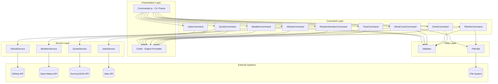
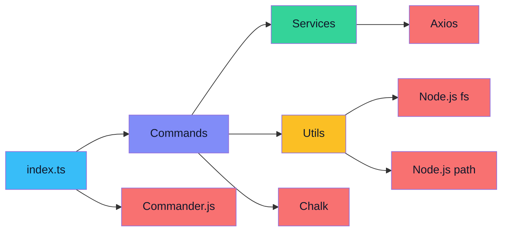

# 📐 Architecture Diagram

> DevTool CLI — Layered Architecture Overview

## System Architecture

```mermaid
flowchart TB
    subgraph Presentation["Presentation Layer"]
        CLI["Commander.js - CLI Parser"]
        CHALK["Chalk - Output Formatter"]
    end

    subgraph Commands["Command Layer"]
        G[GreetCommand]
        T[TimeCommand]
        R[RandomNumberCommand]
        FI[FileInfoCommand]
        WC[WordCountCommand]
        GH[GithubCommand]
        W[WeatherCommand]
        Q[QuoteCommand]
        J[JokeCommand]
    end

    subgraph Services["Service Layer"]
        GS[GithubService]
        WS[WeatherService]
        QS[QuoteService]
        JS[JokeService]
    end

    subgraph Utils["Utility Layer"]
        V[Validator]
        FU[FileUtils]
    end

    subgraph External["External Systems"]
        GHAPI[(GitHub API)]
        WMAPI[(Open-Meteo API)]
        QAPI[(DummyJSON API)]
        JAPI[(Joke API)]
        FS[(File System)]
    end

    CLI --> G & T & R & FI & WC & GH & W & Q & J
    G & T & R & FI & WC & GH & W & Q & J --> CHALK

    GH --> GS
    W --> WS
    Q --> QS
    J --> JS

    G & FI & WC & GH & W --> V
    FI & WC --> FU
    FU --> FS

    GS --> GHAPI
    WS --> WMAPI
    QS --> QAPI
    JS --> JAPI
```

## Component Dependency Graph

```mermaid
flowchart LR
    INDEX[index.ts] --> CMD_LAYER[Commands]
    CMD_LAYER --> SVC_LAYER[Services]
    CMD_LAYER --> UTIL_LAYER[Utils]
    SVC_LAYER --> AXIOS[Axios]
    UTIL_LAYER --> NODE_FS[Node.js fs]
    UTIL_LAYER --> NODE_PATH[Node.js path]
    INDEX --> COMMANDER[Commander.js]
    CMD_LAYER --> CHALK_LIB[Chalk]

    style INDEX fill:#38bdf8,color:#0f172a
    style CMD_LAYER fill:#818cf8,color:#0f172a
    style SVC_LAYER fill:#34d399,color:#0f172a
    style UTIL_LAYER fill:#fbbf24,color:#0f172a
    style AXIOS fill:#f87171,color:#0f172a
    style NODE_FS fill:#f87171,color:#0f172a
    style NODE_PATH fill:#f87171,color:#0f172a
    style COMMANDER fill:#f87171,color:#0f172a
    style CHALK_LIB fill:#f87171,color:#0f172a
```
