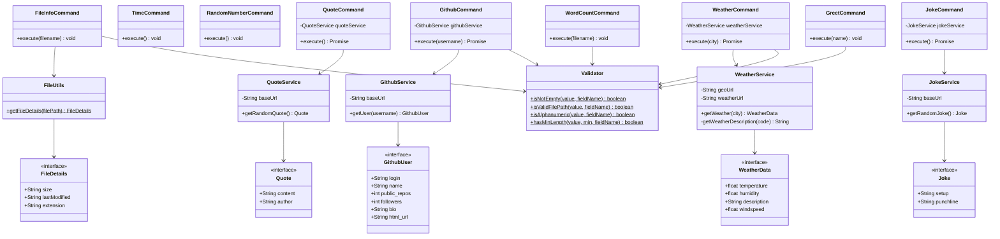

# 🏗️ Class Diagram

> DevTool CLI — OOP Structure with Commands, Services, and Utilities

```mermaid
classDiagram
  class GreetCommand {
    +execute(name) void
  }

  class TimeCommand {
    +execute() void
  }

  class RandomNumberCommand {
    +execute() void
  }

  class FileInfoCommand {
    +execute(filename) void
  }

  class WordCountCommand {
    +execute(filename) void
  }

  class GithubCommand {
    -GithubService githubService
    +execute(username) Promise
  }

  class WeatherCommand {
    -WeatherService weatherService
    +execute(city) Promise
  }

  class QuoteCommand {
    -QuoteService quoteService
    +execute() Promise
  }

  class JokeCommand {
    -JokeService jokeService
    +execute() Promise
  }

  class GithubService {
    -String baseUrl
    +getUser(username) GithubUser
  }

  class WeatherService {
    -String geoUrl
    -String weatherUrl
    +getWeather(city) WeatherData
    -getWeatherDescription(code) String
  }

  class QuoteService {
    -String baseUrl
    +getRandomQuote() Quote
  }

  class JokeService {
    -String baseUrl
    +getRandomJoke() Joke
  }

  class Validator {
    +isNotEmpty(value, fieldName)$ boolean
    +isValidFilePath(value, fieldName)$ boolean
    +isAlphanumeric(value, fieldName)$ boolean
    +hasMinLength(value, min, fieldName)$ boolean
  }

  class FileUtils {
    +getFileDetails(filePath)$ FileDetails
  }

  class GithubUser {
    <<interface>>
    +String login
    +String name
    +int public_repos
    +int followers
    +String bio
    +String html_url
  }

  class WeatherData {
    <<interface>>
    +float temperature
    +float humidity
    +String description
    +float windspeed
  }

  class Quote {
    <<interface>>
    +String content
    +String author
  }

  class Joke {
    <<interface>>
    +String setup
    +String punchline
  }

  class FileDetails {
    <<interface>>
    +String size
    +String lastModified
    +String extension
  }

  GithubCommand --> GithubService
  WeatherCommand --> WeatherService
  QuoteCommand --> QuoteService
  JokeCommand --> JokeService

  GithubService --> GithubUser
  WeatherService --> WeatherData
  QuoteService --> Quote
  JokeService --> Joke

  FileInfoCommand --> FileUtils
  FileInfoCommand --> Validator
  WordCountCommand --> Validator
  GreetCommand --> Validator
  GithubCommand --> Validator
  WeatherCommand --> Validator

  FileUtils --> FileDetails
```
