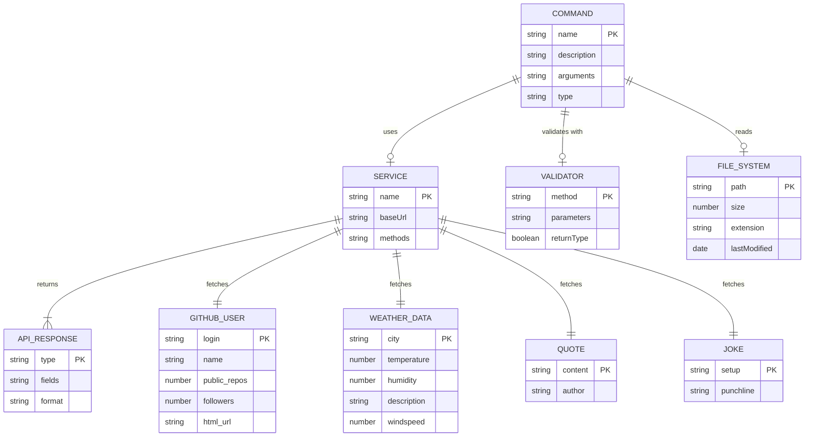

# 🗃️ Entity Relationship Diagram

> DevTool CLI — Data Entities and Their Relationships

```mermaid
erDiagram
    COMMAND {
        string name PK
        string description
        string arguments
        string type
    }

    SERVICE {
        string name PK
        string baseUrl
        string methods
    }

    API_RESPONSE {
        string type PK
        string fields
        string format
    }

    VALIDATOR {
        string method PK
        string parameters
        boolean returnType
    }

    FILE_SYSTEM {
        string path PK
        number size
        string extension
        date lastModified
    }

    GITHUB_USER {
        string login PK
        string name
        number public_repos
        number followers
        string html_url
    }

    WEATHER_DATA {
        string city PK
        number temperature
        number humidity
        string description
        number windspeed
    }

    QUOTE {
        string content PK
        string author
    }

    JOKE {
        string setup PK
        string punchline
    }

    COMMAND ||--o| SERVICE : "uses"
    COMMAND ||--o| VALIDATOR : "validates with"
    COMMAND ||--o| FILE_SYSTEM : "reads"
    SERVICE ||--|{ API_RESPONSE : "returns"
    SERVICE ||--|| GITHUB_USER : "fetches"
    SERVICE ||--|| WEATHER_DATA : "fetches"
    SERVICE ||--|| QUOTE : "fetches"
    SERVICE ||--|| JOKE : "fetches"
```
