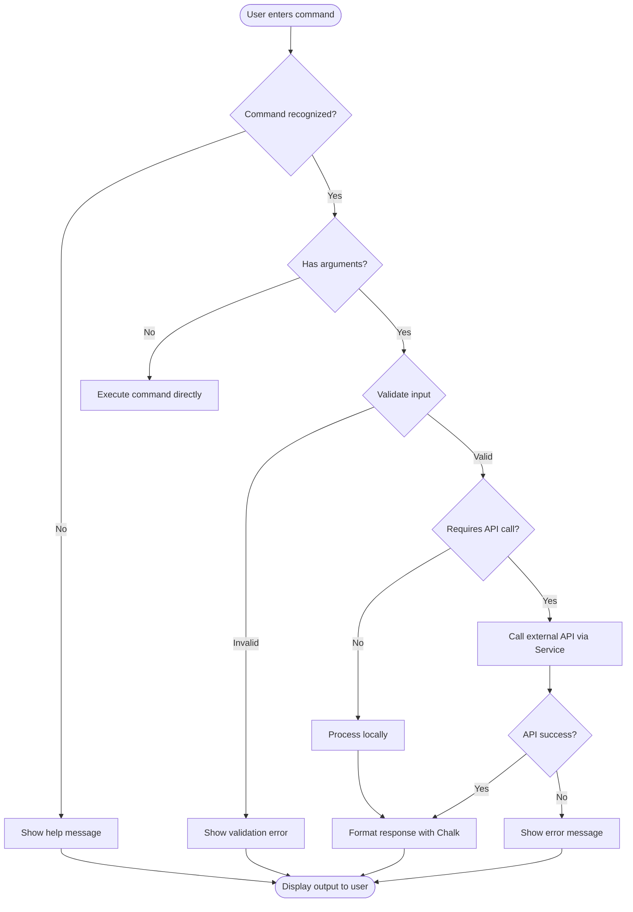
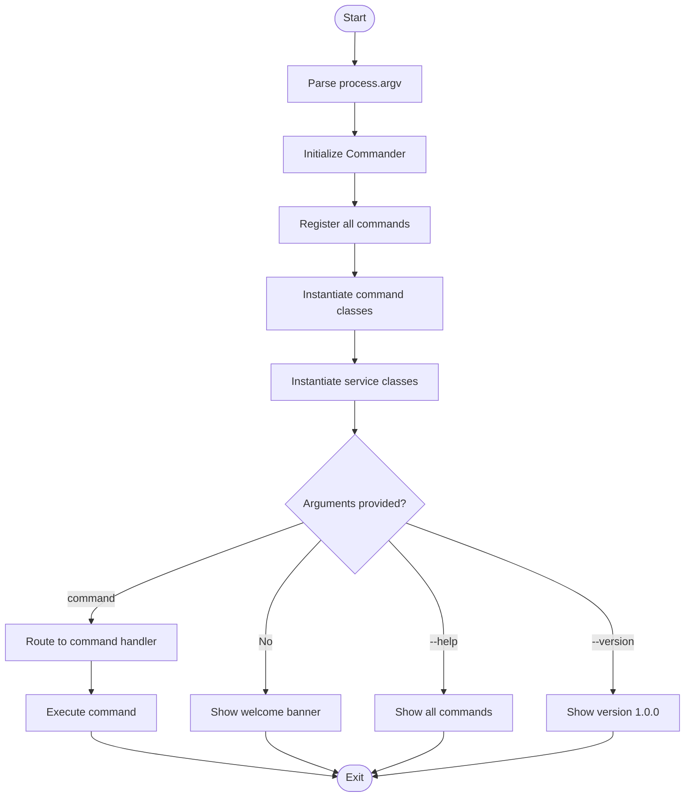

# 📊 Flowcharts

> DevTool CLI — Decision Flow for Command Processing

## General Command Flow

```mermaid
flowchart TD
    A([User enters command]) --> B{Command recognized?}
    B -- No --> C[Show help message]
    B -- Yes --> D{Has arguments?}
    D -- No --> E[Execute command directly]
    D -- Yes --> F{Validate input}
    F -- Invalid --> G[Show validation error]
    F -- Valid --> H{Requires API call?}
    H -- No --> I[Process locally]
    H -- Yes --> J[Call external API via Service]
    J --> K{API success?}
    K -- Yes --> L[Format response with Chalk]
    K -- No --> M[Show error message]
    I --> L
    L --> N([Display output to user])
    G --> N
    M --> N
    C --> N
```

## CLI Startup Flow

```mermaid
flowchart TD
    S([Start]) --> A[Parse process.argv]
    A --> B[Initialize Commander]
    B --> C[Register all commands]
    C --> D[Instantiate command classes]
    D --> E[Instantiate service classes]
    E --> F{Arguments provided?}
    F -- No --> G[Show welcome banner]
    F -- "--help" --> H[Show all commands]
    F -- "--version" --> I[Show version 1.0.0]
    F -- "command" --> J[Route to command handler]
    J --> K[Execute command]
    K --> L([Exit])
    G --> L
    H --> L
    I --> L
```
