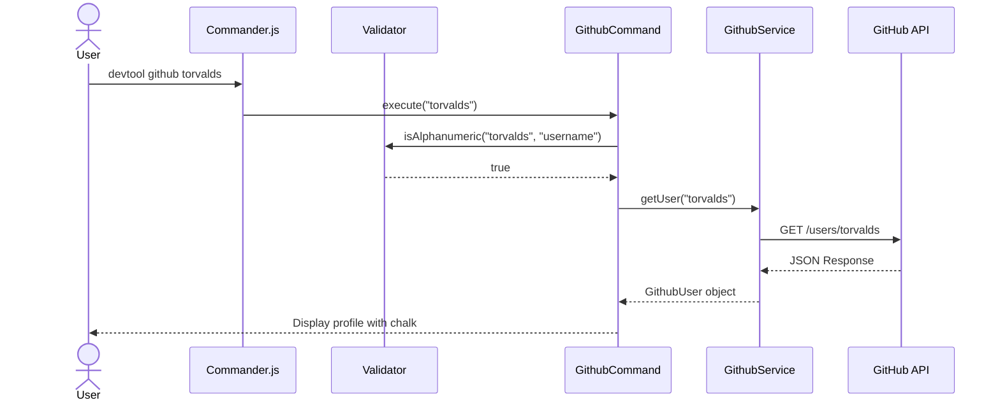
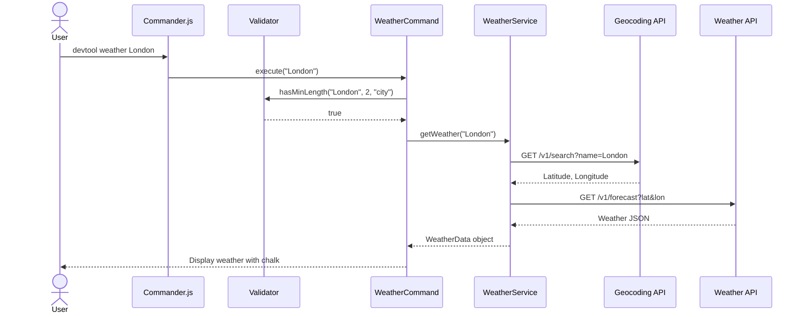
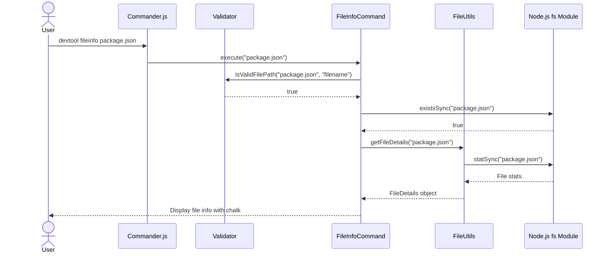
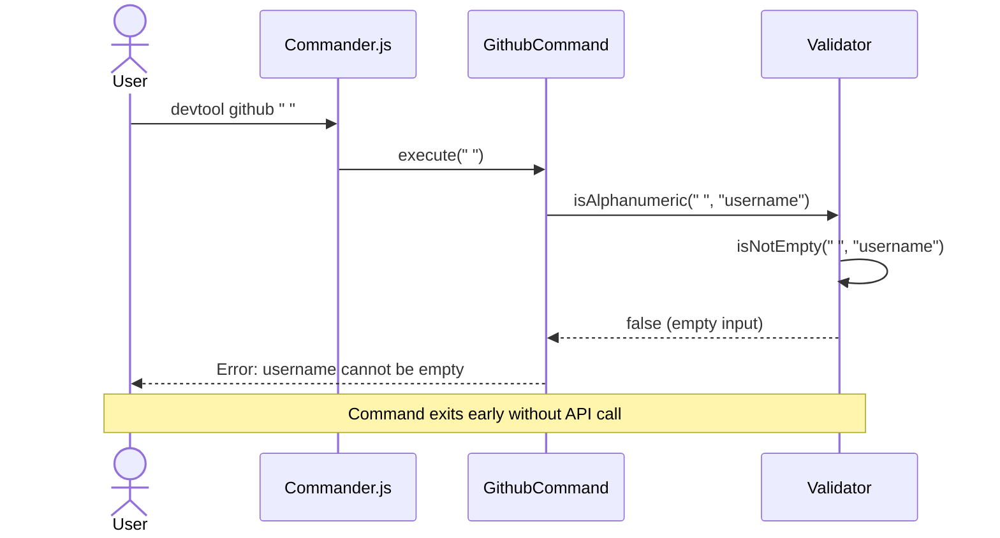

# 🔄 Sequence Diagrams

> DevTool CLI — Interaction Flows Between Components

## GitHub Command Flow

```mermaid
sequenceDiagram
    actor User
    participant CLI as Commander.js
    participant V as Validator
    participant GC as GithubCommand
    participant GS as GithubService
    participant API as GitHub API

    User->>CLI: devtool github torvalds
    CLI->>GC: execute("torvalds")
    GC->>V: isAlphanumeric("torvalds", "username")
    V-->>GC: true
    GC->>GS: getUser("torvalds")
    GS->>API: GET /users/torvalds
    API-->>GS: JSON Response
    GS-->>GC: GithubUser object
    GC-->>User: Display profile with chalk
```

## Weather Command Flow

```mermaid
sequenceDiagram
    actor User
    participant CLI as Commander.js
    participant V as Validator
    participant WC as WeatherCommand
    participant WS as WeatherService
    participant GEO as Geocoding API
    participant WEATHER as Weather API

    User->>CLI: devtool weather London
    CLI->>WC: execute("London")
    WC->>V: hasMinLength("London", 2, "city")
    V-->>WC: true
    WC->>WS: getWeather("London")
    WS->>GEO: GET /v1/search?name=London
    GEO-->>WS: Latitude, Longitude
    WS->>WEATHER: GET /v1/forecast?lat&lon
    WEATHER-->>WS: Weather JSON
    WS-->>WC: WeatherData object
    WC-->>User: Display weather with chalk
```

## File Info Command Flow

```mermaid
sequenceDiagram
    actor User
    participant CLI as Commander.js
    participant V as Validator
    participant FC as FileInfoCommand
    participant FU as FileUtils
    participant FS as Node.js fs Module

    User->>CLI: devtool fileinfo package.json
    CLI->>FC: execute("package.json")
    FC->>V: isValidFilePath("package.json", "filename")
    V-->>FC: true
    FC->>FS: existsSync("package.json")
    FS-->>FC: true
    FC->>FU: getFileDetails("package.json")
    FU->>FS: statSync("package.json")
    FS-->>FU: File stats
    FU-->>FC: FileDetails object
    FC-->>User: Display file info with chalk
```

## Validation Failure Flow

```mermaid
sequenceDiagram
    actor User
    participant CLI as Commander.js
    participant GC as GithubCommand
    participant V as Validator

    User->>CLI: devtool github "   "
    CLI->>GC: execute("   ")
    GC->>V: isAlphanumeric("   ", "username")
    V->>V: isNotEmpty("   ", "username")
    V-->>GC: false (empty input)
    GC-->>User: Error: username cannot be empty
    Note over User,V: Command exits early without API call
```
