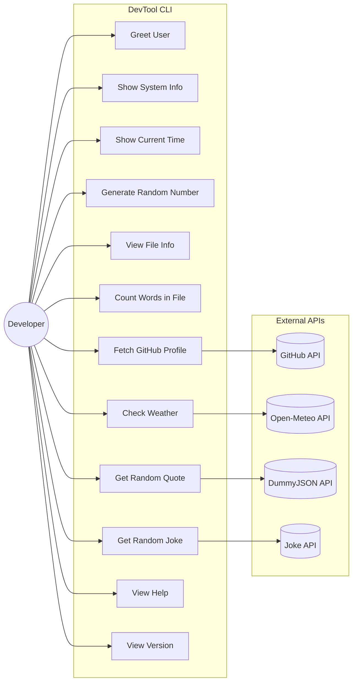

# 👤 Use Case Diagram

> DevTool CLI — Actor and Use Case Relationships

```mermaid
flowchart LR
  User((Developer))

  subgraph DevTool CLI
    UC1[Greet User]
    UC2[Show System Info]
    UC3[Show Current Time]
    UC4[Generate Random Number]
    UC5[View File Info]
    UC6[Count Words in File]
    UC7[Fetch GitHub Profile]
    UC8[Check Weather]
    UC9[Get Random Quote]
    UC10[Get Random Joke]
    UC11[View Help]
    UC12[View Version]
  end

  subgraph External APIs
    API1[(GitHub API)]
    API2[(Open-Meteo API)]
    API3[(DummyJSON API)]
    API4[(Joke API)]
  end

  User --> UC1
  User --> UC2
  User --> UC3
  User --> UC4
  User --> UC5
  User --> UC6
  User --> UC7
  User --> UC8
  User --> UC9
  User --> UC10
  User --> UC11
  User --> UC12

  UC7 --> API1
  UC8 --> API2
  UC9 --> API3
  UC10 --> API4
```
